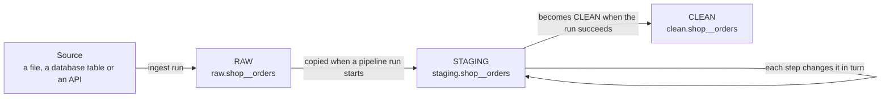

# Stages, pipelines and what they record

A version 1 source loads each dataset into one table, `datasets.<source>__<dataset>`, and that
is still exactly what happens to a source without a pipeline. A pipeline adds three more copies
of a dataset, one per **stage**, and a set of tables recording what each run of it did.



## The three stages

| Stage | What it holds | How long it is kept |
|---|---|---|
| **RAW** | Exactly what was ingested, every ingest run's rows, each row tagged with the run that brought it (`_run_id`). | Only ever added to. Kept until the dataset is deleted. |
| **STAGING** | The working copy one pipeline run transforms, step by step. | Dropped when that run ends, whether it succeeded or failed. |
| **CLEAN** | The result of the last pipeline run that succeeded: the copy anything downstream reads. | Replaced by each successful run. A failed run leaves it as it was. |

**RAW cannot be changed.** Every RAW table is created with a database trigger that refuses any
`UPDATE`, `DELETE` or `TRUNCATE`, whoever sends it — so a pipeline, a bug or a person at a SQL
prompt gets an error saying the table is append-only. New rows and new columns can still be
added by later ingest runs; a column cannot change its type, because that would change what was
ingested.

Because RAW keeps every ingest, a dataset loaded in full every day keeps every day's copy. That
is the price of being able to rerun a pipeline over exactly what came in. STAGING and CLEAN hold
one copy each, and STAGING only while a run is going.

## The naming rule

Each stage is a PostgreSQL schema of its own — `raw`, `staging` and `clean` — and holds one table
per dataset, named `<source>__<dataset>` exactly as the version 1 table in `datasets` is:

- the `orders` dataset of the `shop` source is `raw.shop__orders`, `staging.shop__orders` and
  `clean.shop__orders`;
- source and dataset names follow the same rule as always: lowercase letters, digits and single
  underscores, starting with a letter, not ending with `_`;
- the table name is at most 63 bytes, PostgreSQL's limit, which the schema name does not count
  towards.

The rule is written once, in `stage_table` in `src/udp/names.py`. Every stage table is named
through it, and it refuses a name that breaks the rule instead of shortening it.

## What a pipeline records

All of these live in the `platform` schema. A **pipeline run** is called an *execution* in the
tables, because `platform.pipeline_runs` already holds the ingest runs and keeps doing so.

| Table | One row per |
|---|---|
| `pipelines` | pipeline, by source, dataset and name |
| `pipeline_versions` | version of a pipeline's definition. Changing a pipeline adds a version; old versions are never rewritten, so an old run still says what it ran. |
| `pipeline_steps` | step of a version, in order, with its configuration |
| `pipeline_executions` | run of a pipeline version: when, how it was started, its status, rows in and out, and — when it failed — which step and why |
| `step_executions` | step a run carried out: its status, duration, rows in and out, values changed and error |
| `profiles` | profile of a dataset at one stage in one run, optionally taken after a given step |
| `constraint_results` | constraint checked on a dataset at one stage in one run: whether it held, how many rows and values broke it, and whether it is critical |
| `constraint_violations` | value that broke a constraint: the column, the row it is in and the value |
| `lineage` | place the data passed through in one run, in order |

**Every result says which run it came from.** A profile, a constraint result and a lineage row
each belong to exactly one run: an ingest run or a pipeline run, never both and never neither;
the database refuses anything else. Because a result is kept per dataset, per stage and per run,
the same dataset can be profiled before and after a pipeline, and in every later run, and none of
those profiles replaces another.

**Lineage is a chain per run.** An ingest run's chain is the source (where it was read from) and
then its RAW table. A pipeline run's chain is the RAW table, each step in pipeline order, and the
CLEAN table. Following the two back from a CLEAN table reaches the file or table the data came
from. A run that fails part-way has a chain that stops at the step that failed.

## Profiles

A profile describes one stage table of a dataset, so that the same dataset can be profiled in
RAW and again in CLEAN and the two compared. `udp profile <source> <dataset> --stage raw`
profiles a table, prints the profile and stores it; `--stage` is `raw`, `staging` or `clean`.
It belongs to the newest run that made the table: for RAW the newest succeeded ingest run that
added rows to it, for STAGING the pipeline run going on, for CLEAN the newest pipeline run that
succeeded. With none, the command stops without storing anything.

What a profile holds, column by column and for the whole table:

| Part | What it counts |
|---|---|
| Rows and columns | the table's rows, and each column with the type it is stored as |
| Missing values | the empty cells of each column |
| Cardinality | the distinct values of each column; for text, which values are most and least used and the pattern nearly all of them share |
| Ranges and distributions | the lowest, highest and mean value of a number or date column, and a 20-bar histogram between them |
| Duplicates | rows that repeat another on the dataset's `primary_key`, when its source.yaml declares one and the table still has those columns, otherwise on all of its columns; the profile says which it used |
| **Data-quality problems** | a value that does not fit its column's declared type (`columns:` in source.yaml) — text in an integer column, an invalid date — and an empty cell in a column that must have a value: a `primary_key` column or one with a `not_null` check |
| **Statistical outliers** | numbers far from the rest of their column, by the column's outlier rule |

**A value is a quality problem or an outlier, never both.** A value that does not fit its type
is a quality problem. Outliers are looked for only among the values that do fit and are finite,
so `abc` in an integer column is a quality problem and `1000` among numbers around 12 is an
outlier.

**Outlier rules.** The default is IQR with k = 1.5: a value below Q1 − 1.5 × IQR or above
Q3 + 1.5 × IQR, where Q1 and Q3 are the column's quartiles and IQR = Q3 − Q1. A column can use a
larger or smaller k, percentiles instead (a value below the 1st or above the 99th percentile by
default), or no outlier detection at all. On the command line, `--outliers` sets the rule:
`--outliers amount=iqr:3`, `--outliers price=percentile:5:95`, `--outliers id=none`, or without
`COLUMN=` for every column; repeat it for more columns. Quartiles and percentiles are
interpolated linearly between the two nearest values.

**Large tables.** A table of more than one million rows is profiled on a random sample of one
million of them. The profile says it was sampled, how many rows the table has and how many were
profiled; every count in it is of the profiled rows.

**Before and after.** `PostgresStages.compare_profiles(before, after)` takes two stored profiles
and returns, for each, its rows, missing values, values that do not fit their type, outliers
and duplicates — the effect of a pipeline on its dataset:

```text
                 BEFORE       AFTER
Rows                  10           6
Missing values         5           1
Invalid values         2           0
Outliers               2           1
Duplicates             1           0
```

The dashboard's profile tab still profiles the dataset's `datasets` table directly when it is
opened, and stores nothing.

## For the code that writes these

`PostgresLoader.stages()` opens one transaction and returns the calls that write and read all of
the above (`src/udp/storage/postgres.py`). Two of them carry the retention rules, so no caller
has to remember them: `start_staging` makes STAGING a fresh copy of RAW, and `finish_execution`
records the end of a run and, in the same transaction, turns STAGING into CLEAN when the run
succeeded or drops it when it failed. STAGING is one table per dataset, so only one pipeline run
of a dataset may be going at a time.

Profiling is `src/udp/profiling/`: `profile_frame` profiles any table given as a Polars frame,
`profile_stage` reads a stage table (or its sample) into one, and `PostgresStages.profile` does
both and stores the result with its dataset, stage, run and — between two steps — the step it
followed. A pipeline step builds its `ProfileSettings` with `ProfileSettings.for_dataset`, giving
any column its own `OutlierRule`.
