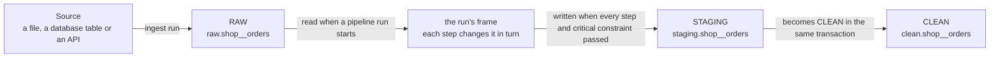

# Stages, pipelines and what they record

A version 1 source loads each dataset into one table, `datasets.<source>__<dataset>`, and that
is still exactly what happens to a source without a pipeline. A pipeline adds three more copies
of a dataset, one per **stage**, and a set of tables recording what each run of it did.



## A pipeline

A pipeline is one file, `pipelines/<name>.yaml`, in the folder `sources/` is in. It names the
dataset it prepares, which profiles to take, the constraints the result must meet and its steps,
in order:

```yaml
source: demo_csv            # a folder under sources/
dataset: customers          # a dataset in that source's source.yaml
profile: ends               # none | ends | every_step; ends when left out
constraints:                # left out: the dataset's own, from its source.yaml
  - constraint: not_null
    column: customer_id
    critical: true
steps:                      # none at all is allowed: RAW's rows become CLEAN as they are
  - type: normalize_values
    columns: [city]
    trim: true
  - type: python
    script: scripts/custom/customer_transform.py
```

The step types and their settings are the transformations' own (`src/udp/transformations/`);
a `python` step is described in `custom-python-steps.md`, and constraints in `constraints.md`.

```
uv run --locked udp pipeline run demo_csv_customers      run it; exit 0 when it succeeded
uv run --locked udp pipeline status <run id> [--json]    read a run's record back
```

Over the API, `POST /api/pipelines/{name}/runs` starts a run and answers at once (202) with its
`execution_id`, already recorded as running; `GET /api/pipeline-runs/{execution_id}` reads its
record back, while it runs and after.

**Versions.** Every run stores the definition it is about to run, with everything resolved: the
constraints it checks and each step with every setting, defaults included. When that differs
from the newest stored version it becomes the next version; when it does not, the run uses the
newest. Editing the file, or the source's constraints a pipeline without its own uses, makes a
new version at the next run, and an old run still says which version it ran.

### What a run does

1. **Start.** It takes the dataset's lock — the one an ingest run takes — and records itself as
   running. A second run of the dataset is refused, naming the run in progress (`udp pipeline
   run` exits 1, the API answers 409); a run started while the dataset is being ingested is
   refused too. A run still marked running when the lock is free was cut off, its process gone,
   and is recorded as failed (`Interrupted`) by the next run.
2. **Input.** The dataset's rows as they stand, read from RAW, which is only ever read: for a
   `full` load the newest ingest run's rows, for `append` every row, for `merge` the newest row
   of each primary key. The steps see the dataset's own columns, not `_run_id`, `_loaded_at` or
   `_record_hash`, and the rows in the order of their `_record_hash` — so the same RAW always
   gives the same input, and two runs of one version over it the same CLEAN table.
3. **Steps.** Each runs over the whole frame the step before it left, checked first against
   that frame's columns. Each is recorded as running and then with its status, duration, rows
   in and out, values changed and error, and added to the run's lineage.
4. **Validation.** The constraints are checked against the result, and every outcome is stored.
   One that is `critical` and fails fails the run.
5. **Publish.** In one transaction the result is written to STAGING, STAGING becomes CLEAN, and
   the run is recorded as succeeded with the CLEAN lineage node and its final profile.

**A failure** — a step, a critical constraint, a database error — ends the run failed. Its record
names the step that failed (`failed_step`), the step's settings and the reason; a run that failed
at validation names `validation` in its error instead. STAGING is dropped and CLEAN stays
exactly as the last successful run left it: a failed run never publishes a half-prepared table.

**Profiles.** `profile: ends`, the default, profiles the input and the CLEAN table. `every_step`
also profiles the data after each step — a pass over every value per step, which on a large
dataset with a long pipeline adds up, so it is not the default. `none` takes no profile.

**The record** of a run, as `udp pipeline status --json` prints it and the API returns it: the
pipeline, its id and the version that ran, the dataset, the trigger, the status, start and end,
rows in and out, the failed step and the error; then every step of that version with its
settings and what it did (`not_run` for those after a failure), the totals of each profile taken,
each constraint's outcome, and the lineage with each step's settings.

## The three stages

| Stage | What it holds | How long it is kept |
|---|---|---|
| **RAW** | Exactly what was ingested, every ingest run's rows, each row tagged with the run that brought it (`_run_id`). | Only ever added to. Kept until the dataset is deleted or loaded again with `--full-refresh`. |
| **STAGING** | The result of one pipeline run's steps, on its way to CLEAN. | Exists only inside the run's last transaction: it becomes CLEAN, or is dropped when the run fails. |
| **CLEAN** | The result of the last pipeline run that succeeded: the copy anything downstream reads. | Replaced by each successful run. A failed run leaves it as it was. |

**RAW cannot be changed.** Every RAW table is created with a database trigger that refuses any
`UPDATE`, `DELETE` or `TRUNCATE`, whoever sends it — so a pipeline, a bug or a person at a SQL
prompt gets an error saying the table is append-only. New rows and new columns can still be
added by later ingest runs; a column cannot change its type, because that would change what was
ingested.

**`udp run` fills RAW.** Each run adds the rows it read to RAW in the same transaction as the
dataset's own table, with the same columns and types, so a failed run adds nothing. A first load,
and `udp run <source> --full-refresh`, deletes RAW and starts it over with that run's rows — the
one way out when a source column changes type.

Because RAW keeps every ingest, a dataset loaded in full every day keeps every day's copy. That
is the price of being able to rerun a pipeline over exactly what came in. STAGING and CLEAN hold
one copy each, and STAGING only while a run is going.

## The naming rule

Each stage is a PostgreSQL schema of its own — `raw`, `staging` and `clean` — and holds one table
per dataset, named `<source>__<dataset>` exactly as the version 1 table in `datasets` is:

- the `orders` dataset of the `shop` source is `raw.shop__orders`, `staging.shop__orders` and
  `clean.shop__orders`;
- source and dataset names follow the same rule as always: lowercase letters, digits and single
  underscores, starting with a letter, not ending with `_`;
- the table name is at most 63 bytes, PostgreSQL's limit, which the schema name does not count
  towards.

The rule is written once, in `stage_table` in `src/udp/names.py`. Every stage table is named
through it, and it refuses a name that breaks the rule instead of shortening it.

## What a pipeline records

All of these live in the `platform` schema. A **pipeline run** is called an *execution* in the
tables, because `platform.pipeline_runs` already holds the ingest runs and keeps doing so.

| Table | One row per |
|---|---|
| `pipelines` | pipeline, by source, dataset and name |
| `pipeline_versions` | version of a pipeline's definition. Changing a pipeline adds a version; old versions are never rewritten, so an old run still says what it ran. |
| `pipeline_steps` | step of a version, in order, with its configuration |
| `pipeline_executions` | run of a pipeline version: when, how it was started, its status, rows in and out, and — when it failed — which step and why |
| `step_executions` | step a run carried out: its status, duration, rows in and out, values changed and error |
| `profiles` | profile of a dataset at one stage in one run, optionally taken after a given step |
| `constraint_results` | constraint checked on a dataset at one stage in one run: whether it held, how many rows and values broke it, and whether it is critical |
| `constraint_violations` | value that broke a constraint: the column, the row it is in and the value |
| `lineage` | place the data passed through in one run, in order |

**Every result says which run it came from.** A profile, a constraint result and a lineage row
each belong to exactly one run: an ingest run or a pipeline run, never both and never neither;
the database refuses anything else. Because a result is kept per dataset, per stage and per run,
the same dataset can be profiled before and after a pipeline, and in every later run, and none of
those profiles replaces another.

**Lineage is a chain per run.** An ingest run's chain is the source (where it was read from) and
then its RAW table. A pipeline run's chain is the RAW table, each step in pipeline order, and the
CLEAN table. Following the two back from a CLEAN table reaches the file or table the data came
from. A run that fails part-way has a chain that stops at the step that failed.

## Profiles

A profile describes one stage table of a dataset, so that the same dataset can be profiled in
RAW and again in CLEAN and the two compared. `udp profile <source> <dataset> --stage raw`
profiles a table, prints the profile and stores it; `--stage` is `raw`, `staging` or `clean`.
It belongs to the newest run that made the table: for RAW the newest succeeded ingest run that
added rows to it, for STAGING the pipeline run going on, for CLEAN the newest pipeline run that
succeeded. With none, the command stops without storing anything.

What a profile holds, column by column and for the whole table:

| Part | What it counts |
|---|---|
| Rows and columns | the table's rows, and each column with the type it is stored as |
| Missing values | the empty cells of each column |
| Cardinality | the distinct values of each column; for text, which values are most and least used and the pattern nearly all of them share |
| Ranges and distributions | the lowest, highest and mean value of a number or date column, and a 20-bar histogram between them |
| Duplicates | rows that repeat another on the dataset's `primary_key`, when its source.yaml declares one and the table still has those columns, otherwise on all of its columns; the profile says which it used |
| **Data-quality problems** | a value that does not fit its column's declared type (`columns:` in source.yaml) — text in an integer column, an invalid date — and an empty cell in a column that must have a value: a `primary_key` column or one with a `not_null` check |
| **Statistical outliers** | numbers far from the rest of their column, by the column's outlier rule |

**A value is a quality problem or an outlier, never both.** A value that does not fit its type
is a quality problem. Outliers are looked for only among the values that do fit and are finite,
so `abc` in an integer column is a quality problem and `1000` among numbers around 12 is an
outlier.

**Outlier rules.** The default is IQR with k = 1.5: a value below Q1 − 1.5 × IQR or above
Q3 + 1.5 × IQR, where Q1 and Q3 are the column's quartiles and IQR = Q3 − Q1. A column can use a
larger or smaller k, percentiles instead (a value below the 1st or above the 99th percentile by
default), or no outlier detection at all. On the command line, `--outliers` sets the rule:
`--outliers amount=iqr:3`, `--outliers price=percentile:5:95`, `--outliers id=none`, or without
`COLUMN=` for every column; repeat it for more columns. Quartiles and percentiles are
interpolated linearly between the two nearest values.

**Large tables.** A table of more than one million rows is profiled on a random sample of one
million of them. The profile says it was sampled, how many rows the table has and how many were
profiled; every count in it is of the profiled rows.

**Before and after.** `PostgresStages.compare_profiles(before, after)` takes two stored profiles
and returns, for each, its rows, missing values, values that do not fit their type, outliers
and duplicates — the effect of a pipeline on its dataset:

```text
                 BEFORE       AFTER
Rows                  10           6
Missing values         5           1
Invalid values         2           0
Outliers               2           1
Duplicates             1           0
```

The dashboard's profile tab still profiles the dataset's `datasets` table directly when it is
opened, and stores nothing.

## For the code that writes these

The engine is `src/udp/pipeline/execution.py`; the pipeline file is read by
`src/udp/config/pipeline.py`. `PostgresLoader.stages()` opens one transaction and returns the
calls that write and read all of the above (`src/udp/storage/postgres.py`); the engine asks only
for what the `PipelineStages` protocol in `src/udp/storage/loader.py` lists, which the tests'
in-memory store implements too. Two of the calls carry the retention rules, so no caller has to
remember them: `read_raw` only ever reads RAW, and `finish_execution` records the end of a run
and, in the same transaction, turns STAGING into CLEAN when the run succeeded or drops it when it
failed. STAGING is one table per dataset, so only one pipeline run of a dataset may be going at a
time.

Profiling is `src/udp/profiling/`: `profile_frame` profiles any table given as a Polars frame,
`profile_stage` reads a stage table (or its sample) into one, and `PostgresStages.profile` does
both and stores the result with its dataset, stage, run and — between two steps — the step it
followed. A pipeline step builds its `ProfileSettings` with `ProfileSettings.for_dataset`, giving
any column its own `OutlierRule`.

Constraints are checked the same way: `PostgresStages.check_constraints` checks a dataset's
`constraints:` against one stage table and stores a result per constraint with its run; what they
are and what they record is in `constraints.md`.
